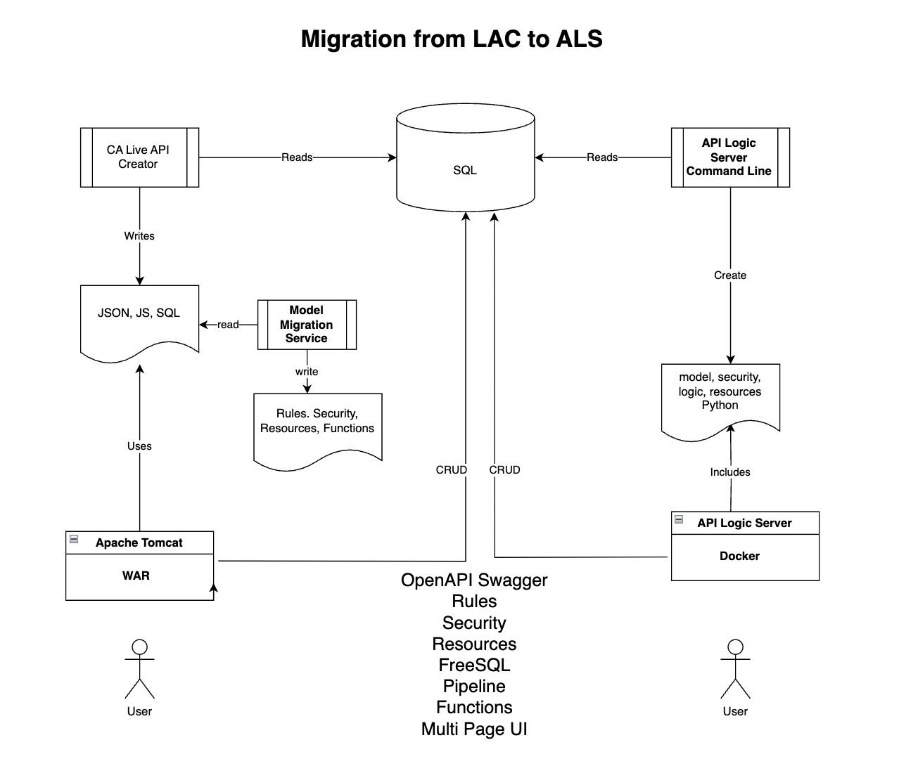

# Model Migration Service

This project reads the CA Live API Creator (LAC) repos to parse objects into a report that can be used by API Logic Server (ALS). This document can help understand how to process to [Migrate from LAC to ALS](https://docs.google.com/document/d/1ULL9sMepOQd4SEwTEl0OP7p7PzEy56Rw2FGkPigUrMc/edit?usp=sharing)

For more information on ALS see -
[Api Logic Server Docs](https://apilogicserver.github.io/Docs/) 

Limitation - this is a tool and requires some manual fixup of rules, functions, or resources. Resources are limited to TableBased and FreeSQL in this version.  ALS table and column names may not match 100%.

The JavaScript requires some fixup to Python and some LAC built-in may not be supported. Finally - there are a features in LAC not currently in ALS (e.g. SysUtility).  


## Install
```
git clone https://github.com/tylerm007/fileReader.git
cd fileReader
python3 install venv venv
source ./venv/bin/activate
pip install -r requirements.txt
```

## Run
Point to you LAC repository home and  and select the project name from the list of 'apis'. The optional sections will only print the directory named.
```
$python3 reposreader.py --help
Generate a report of an existing CA Live API Creator Repository

options:
  -h, --help         show this help message and exit
  --repos REPOS      Full path to /User/guest/caliveapicreator.repository
  --project PROJECT  The name of the LAC project (teamspaces/api) default: demo
  --section SECTION  The api directory name to process [rules, resources, functions, etc.] default: all
  --version          print the version number and exit


python3 reposreader.py  --project demo --repos caliveapicreator.repository --section all

MAC EXAMPLE:
python3 reposreader.py demo /Users/user1/CALiveAPICreator.repository rules
```

## Architecture
LAC uses a file based repository. MMS will read the JSON, JS, and SQL files to create reports for each section that may be copied to ALS.  The conversion of JS to Python requires some manual fixup.



## Skip Sections and Files
This version skips the following files
```
"api.json","issues.json", "apioptions.json", "exportoptions.json", ".DS_Store"
```

## Rules
The code will define a function and rule in Api Logic Server (ALS) Python format. It will also attempt to convert JavaScript to Python - formatting may need to be done manually. Copy the report content to your ALS project directory api/customize_api.py.
```
=========================
       rules 
=========================
def fn_formula_amount(row: models.LineItem, old_row: models.LineItem, logic_row: LogicRow):
     if row.qty_ordered <= 6
        return row.product_price * row.qty_ordered
    else:
        return row.product_price * row.qty_ordered * 0.8


'''
     Title: Discounted price*qty
     Name: formula_amount
     Entity: LineItem
     Comments: Reactive Logic is expressed in JavaScript
     RuleType: formula
'''
     Rule.formula(derive=models.LineItem.amount calling=fn_formula_amount)

```


## Data Sources
The data_sourced will generate a sample table, columns, keys, and foreign keys. Note: views and procedures not shown in this version. The report will also include API REST endpoints for each table.  This is optional and can be used if the ALS generated API names do not match the LAC table names.
```
=========================
       data_sources 
=========================
------------------------------------------------------------
Database: Derby 
  URL:jdbc:derby:directory:/Users/user1/derby/Demo 
  User: DEMO Schema: DEMO
------------------------------------------------------------

create table product (
   product_number BIGINT not null AUTO_INCREMENT
   ,name VARCHAR(50) not null 
   ,price DECIMAL(19,4) not null 
   ,icon BLOB  
   ,full_image BLOB  
)

# PRIMARY KEY('product_number')

ALTER TABLE ADD CONSTRAINT fk_lineitem_purchaseorder FOREIGN KEY LineItem(order_number) REFERENCES PurchaseOrder(order_number)

# Generate alternate endpoints if the ORM tableName is different from the SQL name
@app.route('/LAC/rest/default/b2bderbynw/v1/user', methods=['GET', 'POST','PUT','OPTIONS'])
@admin_required()
def user():
	root = CustomEndpoint(model_class=models.User)
	result = root.execute(request)
	return transform('LAC', 'user', result)

```

## Security
List of users and roles (note views and procedures not listed in this version) - this section can be used to configure the ALS role based grant security.
```
=========================
       security 
=========================
Role: API Documentation TablePermission: A
Role: Read only TablePermission: R
Role: Supplier TablePermission: N
Role: Full access TablePermission: A
Role: Authorized per region TablePermission: A

def Roles():
	API_Documentation = 'API Documentation'
	Read_only = 'Read only'
	Supplier = 'Supplier'
	Full_access = 'Full access'
	Authorized_per_region = 'Authorized per region'

##Access Levels: ['READ', 'UPDATE'] TablePermissions: N description: Only My Supplier
Grant(on_entity=models.Suppliers , can_read = True, can_update = True, can_insert = False, can_delete = False, to_role=Roles.Supplier)
#filter="SupplierID" = @{ID}

#Access Levels: ['READ'] TablePermissions: N description: Promotions
Grant(on_entity=models.Promotions , can_read = True, can_update = False, can_insert = False, can_delete = False, to_role=Roles.Supplier)


#Role: APIDocumentation TablePermission: A
insert into UserRole(user, role_name, can_read, can_insert, can_update, can_delete)
values('swaggger','APIDocumentation', True, True , True , True)

#Role: Readonly TablePermission: R
insert into UserRole(user, role_name, can_read, can_insert, can_update, can_delete)
values('guest', 'Readonly', True, False , False , False)

#Role: Supplier TablePermission: N
insert into UserRole(role_name, can_read, can_insert, can_update, can_delete)
values('Supplier', False, False , False , False)

#Role: Fullaccess TablePermission: A
insert into UserRole(user, role_name, can_read, can_insert, can_update, can_delete)
values('demo','Fullaccess', True, True , True , True)
insert into UserRole(user, role_name, can_read, can_insert, can_update, can_delete)
values('admin','Fullaccess', True, True , True , True)

#Role: Authorizedperregion TablePermission: A
insert into UserRole(user, role_name, can_read, can_insert, can_update, can_delete)
values('region','Authorizedperregion', True, True , True , True)


User: demo Role: ['Full access']
User: guest Role: ['Read only']
User: admin Role: ['Full access']
User: region Role: ['Authorized per region']
```

## Resources
The resource list is user defined endpoints.  Some are nested documents shown as D - directory and F - File. 

To support Resources - Copy system/custom_endpoint.py and system/free_sql_py to ALS api/ directory.

and include these in your import:
```
from api.custom_endpoint import CustomEndpoint
from api.free_sql import FreeSQL
```
```
=========================
       RESOURCES 
=========================
| --- D Customers
| --- F Customers.json Entity: customer  Attrs: (name,balance,credit_limit) 
| ------ D Orders
| ------ F Orders.json Entity: PurchaseOrder Join: ("customer_name" = [name]) Attrs: (order_number,amount_total,paid,notes)
| --------- D LineItems
| --------- F LineItems.json Entity: LineItem Join: ("order_number" = [order_number]) Attrs: (product_number,order_number,qty_ordered ,product_price,amount)
| ------------ D Product
| ------------ F Product.json Entity: product Join: ("product_number" = [product_number]) Attrs: (name,price,product_number)
```
### safrs.JSON API example:
The SAFRS jsonapi allows the user to create a custom API to shape the result to define fields and child/parent relationships. The result requires the client to re-shape the result. 
```
curl -X 'GET' \
  'http://localhost:5656/api/Customer/ALFKI/?include=OrderList%2COrderList.OrderDetailList%2COrderList.OrderDetailList.Product&fields%5BCustomer%5D=Id%2CCompanyName%2CContactName%2CContactTitle%2CAddress%2CCity%2CRegion%2CPostalCode%2CCountry%2CPhone%2CFax%2CBalance%2CCreditLimit%2COrderCount%2CUnpaidOrderCount%2CClient_id' \
  -H 'accept: application/vnd.api+json' \
  -H 'Content-Type: application/vnd.api+json'

Note: entities following relationships
include=OrderList,OrderList.OrderDetailList,OrderList.OrderDetailList.Product
```

### A CustomEndpoint are linked and nested - this becomes the basis for new endpoints 
The CustomEndpoint defines the SAFRS table, with an optional alias
the foreign_key= is the attribute to use to match the parent primaryKey value
the optional fields= will allow the result to be reshaped 
the calling will pass each row to the defined function (create virtual attributes)
the isParent= will treat MANY_TO_ONE relationship and return the parent row 
```
    @@app.route('/rest/default/api/v1/partnerorder/<id>, methods=['GET'])
    def partnerorder(id):
        root = CustomEndpoint(models.Order,"PartnerOrder"
              ,fields=[ (models.Order.CustomerNumber, "CustomerNumber"), (models.Order.OrderNumber, "OrderNumber")]
              ,children=CustomEndpoint(model_class=models.Shipper,alias="Shipper" ,foreign_key=models.Shipper.ShipVia
              ,fields=[ (models.Shipper.CompanyName, "CompanyName")]
              ,isParent=True
                 ,children=CustomEndpoint(model_class=models.OrderDetail,alias="Items" ,foreign_key=models.OrderDetail.OrderId
                 ,fields=[ (models.OrderDetail.ProductNumber, "ProductNumber"), (models.OrderDetail.Quantity, "Quantity")]
                         ,children=CustomEndpoint(model_class=models.Product,alias="Product" ,foreign_key=models.Product.ProductId
                         ,fields=[ (models.Product.ProductName, "ProductName")]
                         ,isParent=True
                         )
                 )
            )
        )
        return root.execute(request, id)
        #or use SAFRS jsonapi
        #return root.get(request, "OrderList%2COrderList.OrderDetailList%2COrderList.OrderDetailList.Product", id)

    def myGetFunction(row: any):
       row["myVirtualAttribute"] = "foo"

curl -X 'GET' \
  'http://localhost:5656/api/partnerorder?Id=1000/
  -H 'accept: application/vnd.api+json' \
  -H 'Content-Type: application/vnd.api+json'

```
## Testing
A separate NodeJS project named [apilogicservercli](https://github.com/tylerm007/apilogicservercli) can be used to login and execute secure commands to do GET/POST/PUT/DELETE.

Resources and Data Sources will generate test scripts that can be used to validate generated endpoints.
```
=============================================================================================
als command line tests for each table endpoint ?page[limit]=10&page[offset]=00&filter[key]=value
=============================================================================================
als login http://localhost:5656 -u u1 -p p -a nw
Logging in...
Login successful, JWT key will expire on: 2023-11-18T15:03:37.342Z

# als get calling Entity ActorTemplate using: /LAC/rest/default/b2bderbynw/v1/Customers?page%5Blimit%5D=1
als get "/LAC/rest/default/b2bderbynw/v1/Customers?page%5Blimit%5D=1" -k 1 


# als patch endpoint: /LAC/rest/default/b2bderbynw/v1/Orders?filter[orderId]=1 - requires checksum
als put "/LAC/rest/default/b2bderbynw/v1/Orders?filter%5BorderId%5D=1"  -j '{"@metadata":{"checkusm":"xx"},...somedata...}'

```
